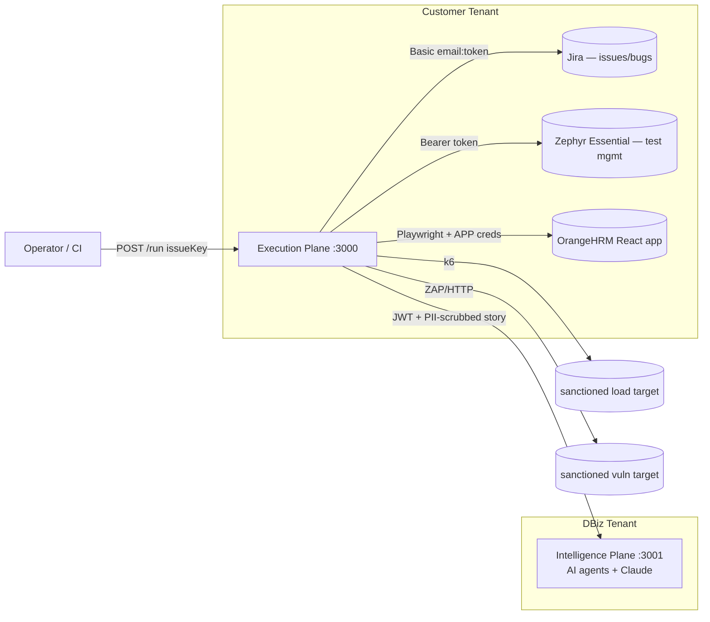

# Architecture — OrangeHRM Execution Plane

## 1. Purpose & context

The Execution Plane (EP) is the **customer-tenant** orchestrator of a two-plane autonomous-QA platform.
Its reason to exist is a single architectural constraint: **AI-driven quality and compliance assurance
must run against regulated production systems without the data or credentials ever reaching the AI provider.**

Jira and Zephyr are reached through the **provider-isolation facade** `clients/alm.client.js`, which composes
`JiraClient` (issue tracker) and `ZephyrClient` (test management) behind the JSDoc contracts in
`clients/alm/*.contract.js`. Business logic depends only on the facade, never on Jira/Zephyr directly.

## 2. Runtime composition (the path that actually executes)

`server.js` mounts only `routes/health` and `routes/run` (on a single shared router exposed at both
`/v1/*` and legacy `/*`). The pipeline:

| Step | Module | Responsibility |
|---|---|---|
| 1 | `clients/alm.client` → `jira.client` | fetch story from Jira (`OHRM-1`) |
| 2 | `clients/intelligence.client` → `middleware/pii-scrubber` | call IP `/api/pipeline` with scrubbed story |
| 2b | `clients/intelligence.client` | `/api/performance`, `/api/pentest` advisory plans |
| 3–4 | `clients/alm.client` → `zephyr.client` | create test cases + Zephyr test cycle |
| 5 | `runners/playwright.runner` | execute Cucumber/Playwright BDD against the OrangeHRM React app |
| 6 | `clients/alm.client` | sync results to Zephyr + create Jira bugs |
| 7–8 | `runners/nonfunctional.runner` | k6 perf + ZAP/HTTP security (sanctioned public targets) |
| 9 | `runners/nonfunctional.runner` | collect reports |

Cross-cutting: `lib/logger` (winston, PII-redacted, console + file), `lib/childLog` (raw child stream),
`lib/execution-context` (tenant-owned AI selection shipped to the IP, ADR-0011),
`middleware/startup-guard` (sovereign-split boot enforcement).

## 3. The Sovereign Split (key decision)

See [`adr/ADR-0001-sovereign-split.md`](adr/ADR-0001-sovereign-split.md). In short: the EP **may not hold any
raw AI credential** (boot-time provider-agnostic hard ban), PII is scrubbed before the boundary, and the
Intelligence Plane independently re-guards responses. This is the platform's principal differentiator.
Under Model B (ADR-0011) the EP owns AI *selection* but ships only credential **references** (`kv://…`).

## 4. Quality attributes — current state vs target

| Attribute | Current | Target | Notes |
|---|---|---|---|
| Security (entrypoint) | ❌ `/run` unauthenticated by default | AuthN/Z + rate limit | opt-in `API_SECRET`; middleware exists in unmounted `src/api` (ADR-0002) |
| Secrets | ❌ plaintext `.env` | Key Vault / Managed Identity | rotate Jira token / Zephyr token / app creds / JWT |
| Scalability | ❌ single instance (process-global lock + fixed artefact files) | stateless workers + queue + external state | |
| Observability | ⚠️ structured logs only | OpenTelemetry + correlation + metrics | runId propagated EP→IP as `X-Request-Id` |
| Resilience | ⚠️ try/catch per step | retry + circuit breaker on live clients | both exist only in dead `src/` |
| Testability | ❌ ~0 unit tests of core | DI seams + unit/integration + coverage gate | clients constructed with `new` |
| Architecture integrity | ❌ dual code tree | single architecture | ADR-0002 |

## 5. Known risks of record

1. **Unauthenticated `POST /run` (by default)** — privileged endpoint that writes to Jira/Zephyr and drives a
   live OrangeHRM login; authentication is opt-in via `API_SECRET`.
2. **Plaintext secrets** — move to a secret manager. (Long-lived `CUSTOMER_JWT` resolved: the EP now uses OAuth2 client-credentials → short-lived JWTs.)
3. **Container runs as root** — partly because Playwright browsers live in `/root/.cache`; a non-root
   switch must relocate the browser cache first.
4. **Dual architecture** — `src/` is unmounted and partially broken; consolidate per ADR-0002.
5. **Single-instance** — concurrency is a process-local flag; artefacts are fixed shared paths.
6. **Cross-repo coupling** — the live trace tails the sibling Intelligence-Plane log file by path.

## 6. Decision log

| ADR | Title | Status |
|---|---|---|
| [0001](adr/ADR-0001-sovereign-split.md) | Sovereign-split two-plane architecture | Accepted |
| [0002](adr/ADR-0002-architecture-consolidation.md) | Consolidate the dual code tree | Proposed |
| [0003](adr/ADR-0003-quality-gates.md) | Lint / format / test quality gates | Accepted |
| [0011](adr/ADR-0011-tenant-owned-ai-execution-context.md) | Tenant-owned AI via ExecutionContext (Model B) | Accepted |

The full register (ADR-0004..0007) is in [`adr/README.md`](adr/README.md).
