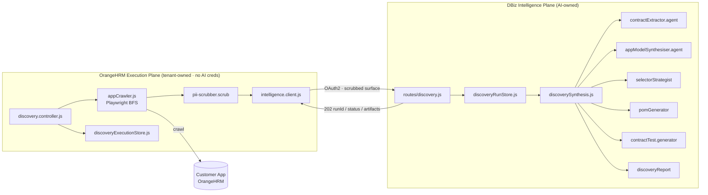
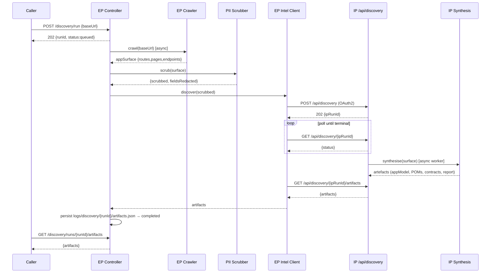
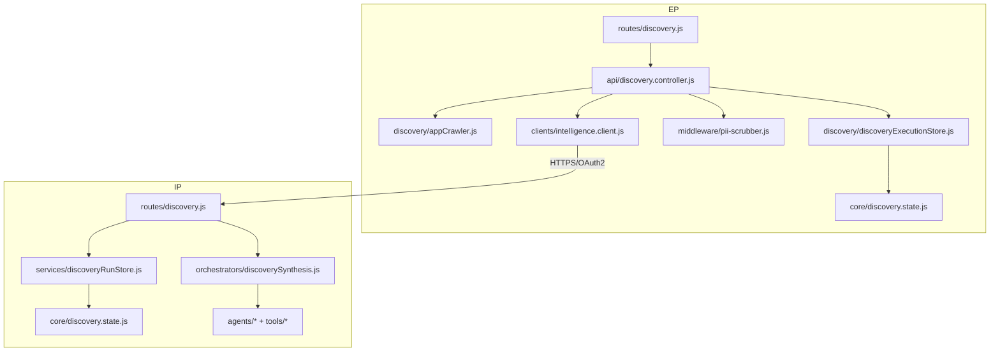
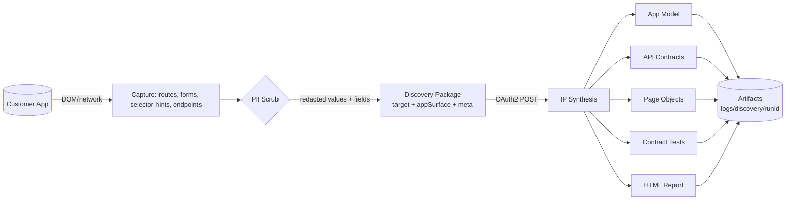
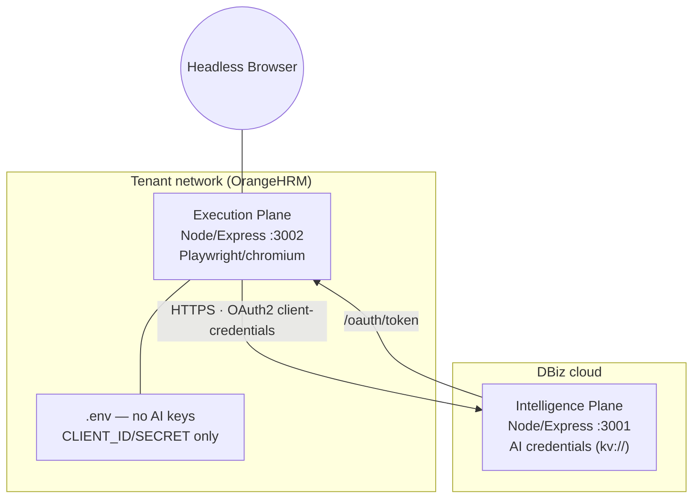
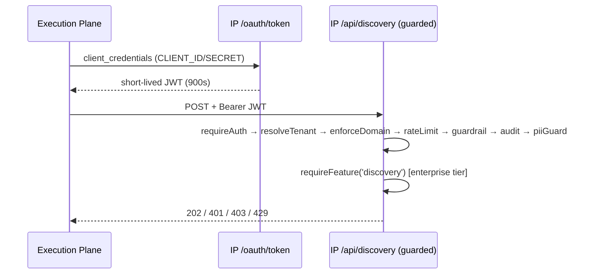
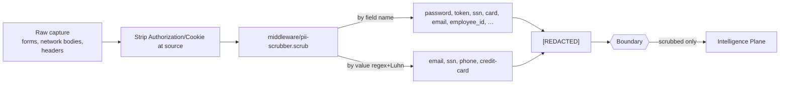

# ADR-0012 — Sovereign-Split Discovery Integration

- **Status:** Accepted
- **Date:** 2026-07-12
- **Deciders:** Platform Engineering (Execution Plane + Intelligence Plane)
- **Supersedes:** the dormant `discovery.controller.js` scaffold that spawned a non-existent local CLI

---

## Executive Summary

The Discovery capability (crawl an application → synthesise an App Model → generate
Page Objects, API contracts and a report) already existed as agents/tools inside the
**DBiz Intelligence Plane**, but was **unreachable**: it had no HTTP surface, and the
**OrangeHRM Execution Plane** only carried a scaffold controller that spawned a
missing local script. This ADR records the integration that connects the two planes
**without duplicating discovery logic** and **without violating the Sovereign Split**:

- The **Execution Plane** performs the deterministic browser crawl (Playwright), DOM/
  network/form capture, and **PII scrubbing** — then ships a scrubbed *application
  surface* to the Intelligence Plane.
- The **Intelligence Plane** performs **all AI reasoning** — contract extraction,
  App-Model synthesis, selector strategy, POM generation, contract-test generation,
  and reporting — via a new async API that **composes the existing agents/tools**.

No AI logic runs in the Execution Plane; no browser/customer-app contact happens in
the Intelligence Plane; only scrubbed metadata crosses the boundary.

## Technical Summary

| Concern | Decision |
|---|---|
| Where the crawl runs | Execution Plane (`src/discovery/appCrawler.js`, Playwright/chromium) |
| Where AI synthesis runs | Intelligence Plane (`src/orchestrators/discoverySynthesis.js`, composes existing agents) |
| Transport | Authenticated OAuth2 client-credentials → `POST /api/discovery` (+ status/artifacts/cancel/retry) |
| Async model | 202 Accepted + `runId`; poll status; download artefacts. Run stores on both planes |
| Reuse, not rewrite | Synthesis composes `contractExtractor`, `appModelSynthesiser`, `selectorStrategist`, `pomGenerator`, `contractTest.generator`, `discoveryReport` — unchanged |
| Sovereignty | EP scrubs before egress; IP holds AI creds; EP holds none; report/PII flows below |

---

## Context

`run-discovery.js` in the Intelligence Plane referenced a top-level orchestrator that
does not exist there; the real, working assets are the **agents** (`crawler`,
`contractExtractor`, `appModelSynthesiser`, …) and **tools** (`pomGenerator`,
`selectorStrategist`, `contractTest.generator`, `schemaInferrer`) plus the
`discoveryReport` renderer. There was **no HTTP route**, so nothing invoked them.

The Execution Plane's `discovery.controller.js` spawned `scripts/run-discovery.js`
(absent in the EP). The `intelligence.client.js` had no discovery method.

The platform's defining constraint is the **Sovereign Split**: the Execution Plane is
tenant-owned and AI-credential-free (it refuses to boot on a raw AI key); the
Intelligence Plane owns all inference. Any integration had to preserve this.

## Decision

Add a **thin synthesis-orchestration layer** in the Intelligence Plane that composes
the existing agents over an EP-supplied surface, expose it as an **async, tenant-gated
API**, and rewrite the EP controller to **crawl locally, scrub, delegate, poll, and
download**. The crawl (deterministic, AI-free) stays EP-side per the responsibility
matrix; all reasoning stays IP-side.

### Responsibility matrix

| Execution Plane (deterministic) | Intelligence Plane (AI reasoning) |
|---|---|
| Browser automation / Playwright | App-Model synthesis |
| Auth, session handling | Route/navigation discovery |
| DOM + screenshot + network capture | API contract extraction |
| Form extraction + selector **hints** | Selector **strategy** |
| **PII scrubbing** | POM generation |
| Packaging the discovery payload | Contract-test generation |
| Artifact download + persistence | Discovery reporting |

---

## Architecture Diagram

## Sequence Diagram

## Component Diagram

## Data-Flow Diagram

## Deployment Diagram

## Security Flow

## PII Flow

---

## Consequences

**Positive**
- Discovery is reachable end-to-end while the Sovereign Split is preserved (verified:
  EP holds no AI key; only scrubbed metadata crosses).
- No duplication — the IP synthesis layer composes the existing agents/tools verbatim.
- Fully async, resumable (checkpoints), cancellable, retryable, tenant-isolated.
- Backward compatible — no existing route/agent/test changed behaviour (EP 115/115,
  IP 956 pass / 0 fail).

**Negative / follow-ups**
- The IP `run-discovery.js` CLI remains dangling (out of scope; the HTTP path replaces it).
- Screenshots are captured EP-side but not yet shipped (metadata only) — a future
  artifact channel can add binary upload if needed.
- Retry currently re-queues state; automatic re-submission requires the EP to re-POST
  (documented in the route).

## Alternatives considered

1. **Crawl in the Intelligence Plane** (reuse `crawler.agent`). Rejected — the IP would
   need direct customer-app + browser access, violating the Sovereign Split.
2. **Port the whole LLM-monolith discovery into the EP.** Rejected — would place AI
   reasoning in the tenant plane and duplicate IP logic.
