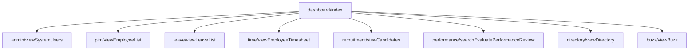

# ADR-0013 — Enterprise Discovery Crawl Enhancement (SPA-aware, multi-route)

- **Status:** Accepted
- **Date:** 2026-07-12
- **Builds on:** [ADR-0012](ADR-0012-sovereign-discovery-integration.md) (Sovereign-Split Discovery integration)
- **Scope:** Execution-Plane crawler (`src/discovery/appCrawler.js`) + additive IP synthesis fields

---

## Executive Summary

The end-to-end Discovery pipeline was functional but the crawler modelled only the
**landing page** of a SPA. A live run against OrangeHRM captured **1 route**. Root
cause: the login step sampled `isVisible()` (non-waiting), so before React hydrated the
form the login was **silently skipped** and the entire crawl ran unauthenticated (the
root then redirected back to `/auth/login`).

This ADR records an **additive** enhancement of the crawler into an enterprise,
SPA-aware, authenticated, multi-route engine — with advanced component discovery, a
navigation graph, BFS/DFS traversal, URL normalisation and cycle detection. No existing
module was rewritten; the crawl API (`crawl(opts)` → `{ target, appSurface, meta }`) is
unchanged and all fields are additive.

### Result (live, OrangeHRM, `maxDepth:1`)

| Metric | Before | After |
|---|---|---|
| Routes | 1 | **12** |
| Authenticated | no (skipped) | **yes (verified)** |
| Forms | 1 | 7 |
| Components classified | 0 | **549** |
| API endpoints | 2 | **56** |
| Navigation edges | 0 | 11 |
| IP artefacts | 3 POMs / 1 contract | **21 POMs / 31 contracts / 4 contract tests** |

Modules discovered: dashboard, admin, pim, leave, time, recruitment, performance,
directory, maintenance, claim, buzz.

---

## Discovery Engine — Reverse-Engineered Component Map

| Component | Plane | Purpose | In → Out |
|---|---|---|---|
| `routes/discovery.js` → `api/discovery.controller.js` | EP | Transport + async worker | HTTP → 202/status/artifacts |
| `discovery/appCrawler.js` | EP | **Deterministic browser crawl** (this ADR) | `{baseUrl,…}` → `appSurface` |
| `middleware/pii-scrubber.js` | EP | Redact before egress | surface → scrubbed surface |
| `discovery/discoveryExecutionStore.js` | EP | Async run lifecycle + artefact persistence | runId → status/artifacts |
| `clients/intelligence.client.js` | EP | OAuth2 transport to IP | package → runId/artifacts |
| `orchestrators/discoverySynthesis.js` | IP | **Composes agents** over the surface | surface → artefacts |
| `agents/contractExtractor` | IP | endpoints → API contracts | captured traffic → contracts |
| `agents/appModelSynthesiser` | IP | app model → virtual story | model → story |
| `tools/selectorStrategist` | IP | hints → robust locator | hints → selector |
| `tools/pomGenerator` · `contractTest.generator` | IP | artefact generation | model/contracts → files |
| `orchestrators/discoveryReport` | IP | HTML report | model → report |

### Execution order

`POST /discovery/run` → **crawl** (auth → seed menu → BFS/DFS: nav → extract forms +
components + links → nav graph) → **scrub** → `POST /api/discovery` → **synthesis**
(contracts → app model → selectors → POMs → contract tests → report) → poll → download
→ persist.

## Enhanced Crawl Sequence

```mermaid
sequenceDiagram
  participant W as EP Worker
  participant CR as appCrawler
  participant BR as Browser
  participant APP as Customer SPA
  W->>CR: crawl({baseUrl, maxDepth, creds, strategy})
  CR->>BR: launch + context + network hooks
  CR->>APP: goto /auth/login
  CR->>APP: waitFor(username visible) → fill → submit
  CR->>APP: waitForURL(/dashboard/) [verify auth]
  CR->>APP: harvest .oxd-main-menu a[href] (seed depth 1)
  loop BFS/DFS until maxPages/maxDepth
    CR->>APP: goto(next) + settle
    CR->>APP: evaluate(extract forms + components + links)
    CR->>CR: record route, page, nav edge; enqueue in-scope links
  end
  CR-->>W: {routes, pages[forms,components], endpoints, navGraph}
```

## Navigation Graph (illustrative)



---

## What changed (additive)

1. **Robust auth** — `authenticate()` waits for the login form (`waitFor visible`) and
   **verifies** the post-login route (`waitForURL(/dashboard/)`). Fixes the silent skip.
2. **SPA menu harvesting** — after auth, seeds the queue from
   `.oxd-main-menu a[href]` / `nav` / `[role=navigation]` links (depth 1), so client-side
   modules are discovered even when the landing page has few links.
3. **Multi-level traversal** — bounded BFS (default) or **DFS** (`strategy`), from the
   authenticated landing page; records the *settled* URL after any client-side redirect.
4. **URL normalisation + cycle/dup detection** — hash removal, trailing-slash, optional
   query collapse (`ignoreQuery`), tracking-param stripping → stable `visited` keys.
5. **Advanced component discovery** — 14 classifiers (button, link, textbox, dropdown,
   checkbox, radio, table/grid, tab, dialog, toast, datepicker, file-upload, accordion,
   chart) with role/ARIA/label/visible/enabled/required + selector hints + a `stability`
   score (`high|medium|low|weak`).
6. **Navigation graph** — `appSurface.navGraph = { nodes, edges }`.
7. **Wider API capture** — now includes `xhr|fetch|websocket|eventsource` and
   `application/graphql` bodies.
8. **IP synthesis (additive)** — `buildAppModel` resolves a selector per component and
   carries `components` + `navGraph` into the app model + artefact metadata. Existing
   agents (routes/forms/contracts) are untouched.

## Backward compatibility & tests
- `crawl()` signature + return shape unchanged; new fields are additive.
- EP `npm test`: **122/122** (7 new crawler-helper tests). EP lint clean.
- IP discovery jest: **8/8**. Full IP suite: unchanged (additive synthesis fields).

---

## Gap Analysis (evidence-based)

| Area | Status | Evidence / Note |
|---|---|---|
| SPA routing (menu/router links) | ✅ Addressed | 1→12 routes live |
| Auth-gated crawl | ✅ Addressed | `authenticated:true` verified |
| Component classification | ✅ Addressed | 549 components across 8 pages |
| Navigation graph | ✅ Addressed | 11 edges captured |
| REST capture | ✅ | 56 endpoints; JSON bodies inferred |
| **Workflow inference (journeys)** | ⚠️ Partial | Nav graph captured; multi-step journey synthesis is IP-side future work |
| **Shadow DOM** | ❌ Gap | `querySelectorAll` does not pierce shadow roots |
| **iFrames** | ❌ Gap | Only the top frame is evaluated |
| **Infinite scroll / virtualised grids** | ❌ Gap | No scroll-to-load; only initially-rendered rows |
| **GraphQL/WebSocket deep parsing** | ⚠️ Partial | Captured as traffic; no operation/message schema extraction |
| **Downloads / file-upload exercise** | ❌ Gap | Detected as components; not exercised |
| **Accessibility audit depth** | ⚠️ Partial | ARIA captured per element; no axe-core scan |
| **Parallel crawling / context pooling** | ❌ Gap | Single context (safe, deterministic); no worker pool |
| **Incremental/resumable crawl** | ⚠️ Partial | Run-level checkpoints exist; page-level resume not yet |

## Enhancement Roadmap

1. **Shadow DOM + iFrame piercing** — recurse `element.shadowRoot` and `page.frames()`
   in the extractor. *(highest coverage ROI)*
2. **Dynamic content** — scroll-to-load + virtualised-grid row harvesting with settle heuristics.
3. **Workflow synthesis** — IP agent that turns the nav graph + forms into ordered
   journeys (Login→PIM→Add→Save→Search→Edit→Delete) with state transitions.
4. **Protocol depth** — GraphQL operation extraction; WebSocket/SSE message schemas.
5. **Accessibility** — inject axe-core per route; attach violations to the component model.
6. **Scale** — bounded context pool for parallel same-origin crawling; page-level resume.
7. **Knowledge graph export** — persist `Application→Module→Page→Component→API→Workflow`
   as a queryable graph for downstream agents (self-healing, coverage).
