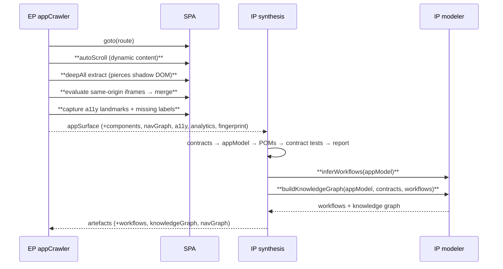
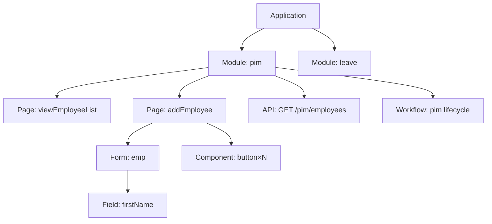

# ADR-0014 — Discovery Phase 2: Deep DOM, Modelling & Analytics

- **Status:** Accepted
- **Date:** 2026-07-12
- **Builds on:** [ADR-0013](ADR-0013-discovery-crawl-enhancement.md) (SPA-aware crawl)
- **Scope:** additive — EP crawler deep-DOM/coverage + IP higher-order modelling

---

## Executive Summary

Phase 1 made the crawler SPA-aware and multi-route (1→12 routes). Phase 2 closes the
**deep-DOM coverage** and **application-modelling** gaps from the ADR-0013 roadmap —
additively, with no breaking changes. Delivered and verified live against OrangeHRM:

| Capability | Plane | Live evidence |
|---|---|---|
| Shadow-DOM piercing (nested, open roots) | EP | capability ran; 0 present in OrangeHRM (honest) |
| Same-origin iFrame traversal + merge | EP | capability ran; 0 present |
| Dynamic content (auto-scroll lazy/infinite/virtualised) | EP | components **549 → 756** |
| Accessibility discovery (landmarks, missing labels) | EP | **38 landmarks, 303 missing labels** |
| Discovery analytics + content fingerprint | EP | full metrics; FNV-1a fingerprint for delta/incremental |
| Business workflow-journey inference | IP | **9 journeys** (e.g. `pim: navigate>create>save>search>edit`) |
| Application knowledge graph | IP | **153 nodes / 171 edges**, 8 node types |

All existing artefacts (App Model, POMs, contracts, contract tests, report, nav graph)
are unchanged. Quality gates: EP **122/122**, IP discovery **16/16**, lint clean.

## What changed (additive)

### Execution Plane — `src/discovery/appCrawler.js`
- **`deepAll(selector, root)`** — shadow-piercing query used for forms, components and
  links; recurses every open `shadowRoot` (nested Web Components).
- **iFrame discovery** — evaluates each same-origin child frame and merges its
  forms/components/links; cross-origin/detached frames are skipped safely.
- **Dynamic content** — `autoScrollInBrowser` scrolls to the bottom until page height
  stabilises (bounded by `scrollSteps`/`maxScrollPx`) before extraction, so
  lazy-loaded/virtualised rows are captured.
- **Accessibility** — landmarks (`header/nav/main/footer/aside` + ARIA roles) and a
  count of interactive elements lacking an accessible name; `keyboardFocusable` count.
- **Analytics** — `meta.analytics` (pages, components, endpoints, shadow roots, iframes,
  a11y, crawler efficiency, budget %, and an FNV-1a **fingerprint** enabling incremental
  / differential discovery).
- New config knobs (safe defaults, all overridable): `dynamicContent`, `scrollSteps`,
  `scrollDelayMs`, `maxScrollPx`, `discoverIframes`, `pierceShadowDom`.

### Intelligence Plane — `src/orchestrators/discoveryModeler.js` (new)
- **`inferWorkflows(appModel)`** — deterministic business-journey inference: groups
  routes by module and emits ordered lifecycle steps
  (`navigate → create → save → search → edit → delete`) with transitions, pre/post
  conditions and decision points for destructive actions.
- **`buildKnowledgeGraph(appModel, contracts, workflows)`** — a typed graph:
  `Application → Module → Page → { Form → Field, Component, API }` and `Workflow → Module`.
- `discoverySynthesis` composes these after the existing agents and returns `workflows`,
  `knowledgeGraph`, and `navGraph` in the artefacts (existing agents untouched).

## Sequence (Phase-2 additions in bold)

## Knowledge Graph shape

## Backward compatibility & tests
- `crawl()` signature + return shape unchanged; all new fields additive.
- EP `npm test`: **122/122** (crawler-helper tests incl. `fnv1a`). Lint clean.
- IP discovery jest: **16/16** (new `discoveryModeler.test.js` — 8 cases). Full IP suite unaffected (additive).

## Gap Analysis — status after Phase 2

| Area | Before P2 | After P2 |
|---|---|---|
| Shadow DOM | ❌ | ✅ pierced (open, nested) |
| iFrames | ❌ | ✅ same-origin merged |
| Dynamic content / virtualised grids | ❌ | ✅ auto-scroll load |
| Accessibility discovery | ⚠️ ARIA only | ✅ landmarks + missing-label audit |
| Workflow inference | ⚠️ nav graph only | ✅ ordered journeys + transitions |
| Knowledge graph | ❌ | ✅ typed graph artefact |
| Discovery analytics | ⚠️ counts only | ✅ metrics + efficiency + fingerprint |
| Incremental / differential | ❌ | ⚠️ fingerprint emitted (delta compute = next) |
| Parallel crawling | ❌ | ❌ (deliberately deferred — determinism) |
| GraphQL schema / WS message flows | ⚠️ captured | ⚠️ captured; schema inference = next |
| Closed shadow roots | ❌ | ❌ (not exposable by design) |

## Roadmap (remaining)

1. **Incremental discovery** — persist the fingerprint + prior artefacts; compute a delta
   report and skip unchanged modules. *(fingerprint already emitted)*
2. **Parallel crawling** — bounded same-origin context pool with a deterministic merge
   (stable ordering) behind a `concurrency` flag.
3. **Protocol depth** — GraphQL operation/type inference; WebSocket/SSE message schemas.
4. **Accessibility depth** — inject axe-core per route; attach violations to components.
5. **Cross-origin iframes** — opt-in via `page.frame()` handles where policy allows.
6. **Knowledge-graph query API** — expose the graph over an interface for downstream
   agents (coverage, self-healing, impact analysis).
