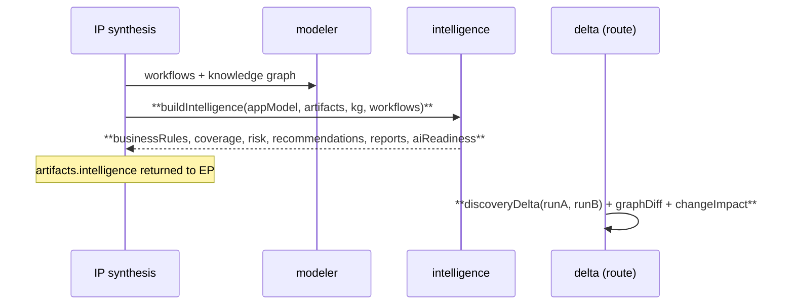
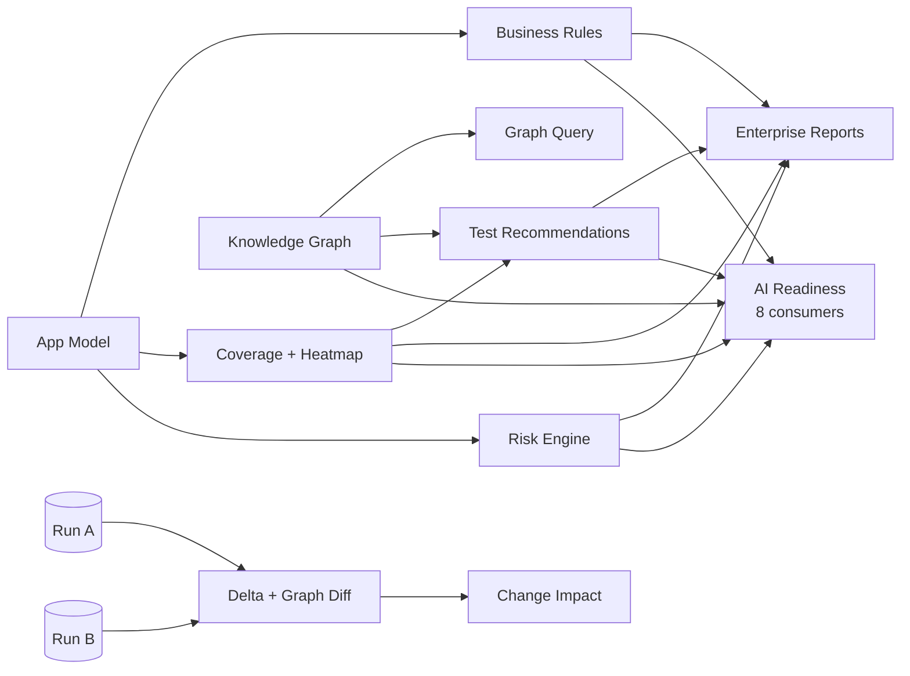

# ADR-0015 — Discovery Phase 3: Autonomous Application Intelligence

- **Status:** Accepted
- **Date:** 2026-07-12
- **Builds on:** [ADR-0014](ADR-0014-discovery-phase2-enterprise.md) (deep DOM + modelling)
- **Scope:** additive, Intelligence-Plane only — no Execution-Plane changes

---

## Executive Summary

Phases 1–2 turned the crawler into a deep, SPA-aware application modeller. Phase 3 turns
that model into an **Autonomous Application Intelligence Platform**: it reasons about
change, coverage, risk, business rules, and recommended tests, and exposes everything to
downstream agents through stable contracts — all as **pure, deterministic** builders
composed alongside the existing synthesis agents. No Execution-Plane code changed; the
Sovereign Split is untouched.

All 10 requested capabilities are implemented and **verified live** against OrangeHRM:

| # | Capability | Live evidence |
|---|---|---|
| 1 | Incremental / delta discovery | run1→run2: pagesAdded 4, apisChanged 6, selectorsChanged 1 |
| 2 | Graph diff engine | nodesAdded 55, edgesAdded 55, nodesChanged 1 |
| 3 | Business-rule discovery | 3 rules (validation + rbac) |
| 4 | Test-coverage intelligence | 90% app coverage, 9-module heat map, a11y score |
| 5 | Risk engine | medium(68): auth 90, destructive 80, api-coverage 55 |
| 6 | AI change-impact analysis | hasImpact=true, 4 impacted pages |
| 7 | Autonomous test recommendation | 42 recommendations (smoke/regression/api/a11y/security) |
| 8 | Graph query engine | modules→9, pagesWithComponent(datepicker)→4 |
| 9 | Enterprise reporting | executive / architect / QA / developer reports |
| 10 | AI readiness | 8 per-consumer contracts (planner…certification) |

Quality gates: IP full suite **974/0-fail**, IP discovery **26/26**, EP **122/122** (unchanged).

## Design

Two new **pure** IP modules, composed into `discoverySynthesis` (per-run) and exposed via
two new routes (cross-run):

- **`src/orchestrators/discoveryIntelligence.js`** — `businessRules`, `coverageIntelligence`
  (+ heat map + discovery confidence), `riskEngine` (scored), `recommendTests`,
  `graphQuery` (query engine), `enterpriseReports`, `aiReadiness` (versioned per-consumer
  contract). `buildIntelligence()` composes the bundle; added to `artifacts.intelligence`.
- **`src/orchestrators/discoveryDelta.js`** — `discoveryDelta` (page/form/API/workflow/
  component/selector diff), `graphDiff` (node/edge diff), `changeImpact` (affected
  POMs/tests/contracts/workflows/APIs/rules).

Synthesis also aggregates the crawler's per-page accessibility into `appModel.accessibility`
(additive) so coverage/risk can score it.

### New endpoints (async run store, tenant-scoped)
- `POST /api/discovery/delta` `{fromRunId,toRunId}` → delta + change-impact
- `POST /api/discovery/:runId/query` `{find,where}` → knowledge-graph query

## Sequence (Phase-3 additions in bold)

## Intelligence data flow

## Consequences

**Positive**
- The discovery output is now *actionable*: risk-ranked, coverage-scored, change-aware,
  and consumable by downstream agents via a versioned contract.
- All builders are pure + deterministic → unit-tested without a browser (10 new tests).
- Fully additive: existing artefacts, agents, routes and the EP are unchanged; both full
  suites stay green.

**Negative / follow-ups**
- API→module attribution in the knowledge graph uses the path's first segment, so
  `apisFromModule('pim')` returns 0 when the API path is `/…/api/v2/pim/…` (module=`api`).
  A future pass can map API paths to their business module.
- Delta requires both runs to be resident in the IP run store (in-memory). Durable
  cross-restart delta needs persisted artefacts (roadmap item, fingerprint already emitted).
- IP checkpoint-persist still logs a non-fatal ENOENT (state dir); in-memory store is
  authoritative. Trivial follow-up.

## Roadmap (remaining)
1. Persisted artefact store → cross-restart incremental delta + version history + delta reports on disk.
2. API-to-business-module mapping for richer graph queries.
3. Visual graph-diff rendering (HTML) + risk/coverage dashboards (the data is already machine-readable).
4. Parallel crawling (still deferred for determinism) and GraphQL/WS schema inference.
